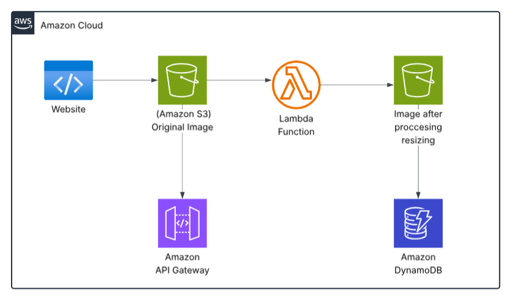

# Serverless Image Processing with S3 and Lambda

## 📌 Overview
This project implements a **serverless image processing pipeline** on AWS.  
Users upload images to an **Amazon S3 bucket**, which triggers an **AWS Lambda function** that processes the images (resize, watermark, etc.) and stores the results in another **S3 bucket**.  

The solution is **event-driven, scalable, and cost-efficient** since it only runs when new images are uploaded.

---

## Diagram



---

## 🏗️ Architecture

**Workflow:**
1. User uploads an image to the **Source S3 bucket**.  
2. The upload event triggers an **AWS Lambda function**.  
3. Lambda resizes (or watermarks) the image using **Pillow** (Python image library).  
4. The processed image is stored in the **Destination S3 bucket**.  
5. (Optional) Metadata about the upload can be stored in **Amazon DynamoDB**.  
6. (Optional) Uploads can be managed through an **API Gateway** endpoint.  

---

## 🔧 AWS Services Used
- **Amazon S3** – Stores original and processed images.  
- **AWS Lambda** – Processes the images automatically.  
- **AWS IAM** – Provides secure permissions for Lambda to access S3.  
- **Amazon API Gateway** *(Optional)* – Allows users to upload via an API.  
- **Amazon DynamoDB** *(Optional)* – Stores metadata (e.g., filename, timestamp, processed size).  
- **AWS Step Functions** *(Optional)* – Manages complex workflows for multi-step image processing.  

---

## 🎯 Learning Outcomes
By completing this project, you will learn:
- Building **event-driven architectures** using S3 triggers and Lambda.  
- Designing **auto-scaling serverless solutions** without managing servers.  
- Applying **least privilege IAM roles and S3 bucket policies** for secure applications.  

---

## 📂 Project Structure
serverless-image-processing/
├── lambda_code/
│   └── lambda_function.py   # Image processing code (resize)
├── setup.sh                 # Bash script to deploy the project
└── README.md                # Documentation

---
## 🚀 Deployment Steps

### 1️⃣ Prerequisites
- AWS account with permissions for S3, Lambda, IAM.  
- **AWS CLI** installed and configured (`aws configure`).  
- **Python 3.9+** and `pip install pillow`.  
- **zip** installed for packaging the Lambda function.  

---

### 2️⃣ Deploy with Bash Script
Run the provided setup script:

```bash
chmod +x setup.sh
./setup.sh
```
---
### 3️⃣ Test the Pipeline

1- Upload an image to the source bucket:

```bash
aws s3 cp test.jpg s3://<SOURCE_BUCKET>/
```

2- Wait a few seconds for Lambda to process it.

3- Check the destination bucket:
```bash
aws s3 ls s3://<DEST_BUCKET>/
```
You should see a resized image (e.g., resized-test.jpg).


